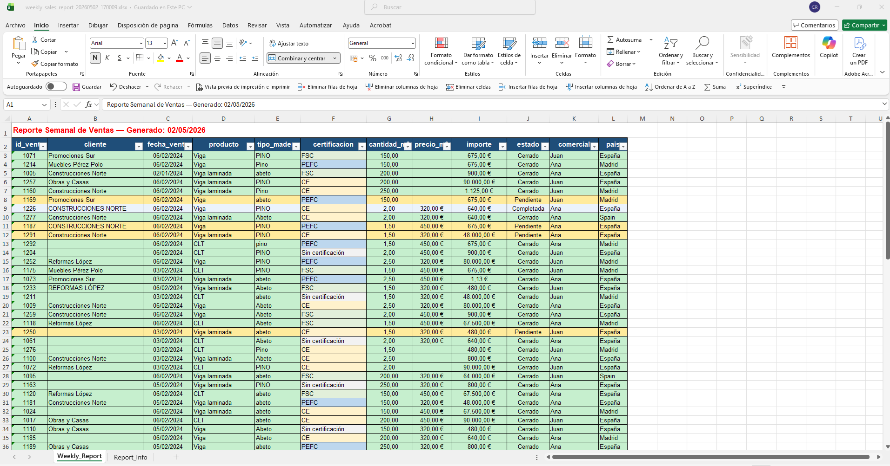

# Excel Sales Pipeline · End-to-End Data Processing with SDD

Modular Python pipeline that automates the consolidation, cleaning and reporting of heterogeneous Excel datasets, reducing manual work and enabling reliable business reporting through strict data validation.

---

## The Problem

Companies often receive multiple Excel files from different branches or sales reps:

- Inconsistent column names (`Cliente`, `cliente`, `razon_social`)
- Mixed date formats
- Inconsistent numeric formats
- Incomplete or invalid data

👉 The result: manual work, errors and wasted time.

---

## The Solution

This project implements an **end-to-end pipeline** that:

1. Consolidates multiple Excel files into a unified dataset
2. Cleans and validates data using strict business rules
3. Generates a professional Excel report
4. Records full execution traceability

**Designed for:**
- Data workflows with messy Excel inputs
- Operations / sales reporting pipelines
- Scenarios where data quality is more important than data volume

---

## Architecture (SDD)

The system follows a **Spec-Driven Development (SDD)** approach:

```text
Stage 1 -> Consolidation
Stage 2 -> Cleaning
Stage 3 -> Formatting
Stage 4 -> Orchestration
```

### Stage 1 · Consolidation
- Unifies heterogeneous schemas
- Adds row-level traceability (`source_file`)
- Does not drop data

### Stage 2 · Cleaning
- Type coercion (dates and numerics)
- Completeness-based deduplication by `id_venta`
- Strict business validation

### Stage 3 · Formatting
- Generates Excel report with two sheets:
  - `Weekly_Report`
  - `Report_Info`
- Professional formatting (colors, totals, layout)

### Stage 4 · Orchestration
- Runs the full pipeline
- Generates timestamped execution logs (`execution_log_YYYYMMDD_HHMM.json`) with complete traceability

### SDD Approach (Inspired by GAIA)

This project follows a Spec-Driven Development (SDD) approach inspired by the GAIA framework (Governed AI for Interactive Applications, 2026).

While not a full GAIA implementation, the pipeline aligns with several of its core principles:

- Separation between specification, execution and validation
- Strong emphasis on data validation as an "evidence-first" mechanism
- Explicit pipeline stages acting as controlled execution flows
- Traceability through structured execution logs

GAIA introduces a formal system of Rules, Workflows and Skills to govern AI-assisted development.  
In this project, similar ideas are applied in a simplified and production-oriented way, adapted to a data pipeline context.

Reference:
Cristina Cachero, *Spec-Driven Development con GAIA: De Cero a Maestro*, 2026.

For a detailed view of the system design, architectural decisions and rationale, see:
→ `docs/SDD_public/`
---

## Usage

```bash
python -m excel_pipeline.cli \
  --input data/raw/ \
  --output data/outputs/ \
  --config configs/wood_sales_config.json
```

---

## Output

**Excel report**
- `weekly_sales_report_YYYYMMDD_HHMMSS.xlsx`
- Sheets: `Weekly_Report`, `Report_Info`

**Execution log**
- `execution_log_YYYYMMDD_HHMM.json`
- Includes: rows per stage, errors, warnings, duration, `cleaning_summary`

---

## Output Preview



---

## Data Quality & Cleaning Diagnostics

The pipeline applies strict business validation:

- `id_venta`, `fecha_venta` and `importe` are required
- `importe` must be positive
- `cantidad_m3` and `precio_m3` must be valid when present

👉 High row removal is expected when source data is incomplete or invalid.

This is not a bug - it is a deliberate design decision:
**The pipeline enforces business rules and prioritises data quality over data volume.**

**Real result on the sample dataset:**

```text
401 rows consolidated
-> 172 duplicates removed
-> 154 invalid rows discarded
= 75 clean rows
```

---

## Key Design Decisions

**Strict business validation**
Business rules are enforced even when discard rate is high.
Prevents degraded reporting quality.

**Completeness-based deduplication**
For duplicate `id_venta` rows, the pipeline keeps the most complete row - not necessarily the first one.

**Multi-format date parsing**
Supports multiple formats in order of priority:
- `DD/MM/YYYY` (primary - Spanish context)
- `YYYY-MM-DD` (ISO)
- `DD-MM-YYYY`
- `MM/DD/YYYY` (fallback)

**Full traceability**
The `execution_log` includes stage-level metrics, cleaning diagnostics (`cleaning_summary`) and enough information to audit every pipeline run.

---

## Architecture Notes

- Schema mapping is driven by JSON config
- Business rules are specified in the SDD and enforced in Stage 2
- Pipeline contracts between stages are explicit and enforced
- Pipeline stages are strictly separated: structure, cleaning, presentation and orchestration
- Cleaning diagnostics are captured in execution logs instead of separate reports

---

## Tech Stack

| Tool | Purpose |
|---|---|
| Python | Core language |
| pandas | Data processing |
| xlsxwriter | Excel report generation |
| argparse | CLI interface |
| pytest | Testing framework |
| JSON config | SDD-driven configuration |

---

## Roadmap

- [ ] Capture Stage 2 warnings inside `cleaning_summary`
- [ ] Local ingestion app (Streamlit)
- [ ] AI-assisted executive dashboard UI
- [ ] Automated report delivery by email
- [ ] AWS deployment (S3 + Lambda + RDS)

---

## Project Status

```text
v1.0.0 - MVP complete
```

- [x] End-to-end functional pipeline
- [x] Robust cleaning and validation
- [x] Professional Excel report
- [x] Full execution traceability
- [x] 74 tests passing

```text
v1.1.0 - Cloud entry complete
```

- [x] AWS Lambda execution validated end-to-end
- [x] S3 I/O adapter (inputs, outputs, config)
- [x] Lambda Layer for production dependencies
- [x] Cloud deployment documented

---

## Notes

This project is part of a portfolio focused on building production-ready data pipelines, combining:

- Data Engineering
- Process automation
- Applied AI for data workflows